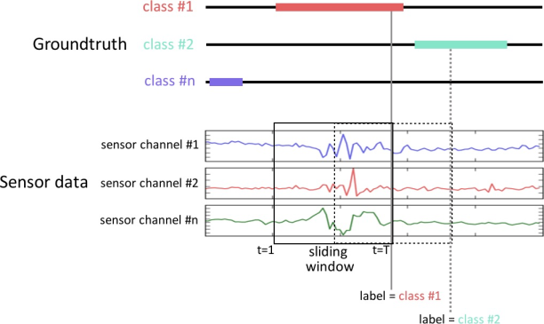

### Introduction

Rapid increase in connectivity of physical sensors and Internet of Things (IoT) systems is enabling large-scale collection of time series data, and the data represents the working patterns and internal evolutions of observed objects. Recognizing and forecasting the underlying high-level  states from raw sensory data are useful for daily activity recognition of humans and  predictive maintenance of machines. Deep Learning (DL) methods have been proved efficient in computer vision, natural language processing, and speech recognition, and these model are also applied to time series analysis. 

Many works has been done to improve the performance of the feature extraction from time series data, but they mostly focus on getting a better vector representation of the time series data from a time window. So a hybrid deep architecture named Long-term Recurrent Convolutional LSTM Network (LR-ConvLSTM) is proposed. The model is composed of Convolutional LSTM layers to extract features inside a high-level state, and extra LSTM layers to capture temporal dependencies between high-level states.

***

### Architecture

* ##### model diagram：

	

* ##### model introduction：

	Our model has three major components: the convolutional layers, the inner LSTM layers and the outer LSTM layers, stacked from bottom to top. The CNN and inner LSTMs are combined to capture features from a sliding window and the output can be seen as the vector representation of a high level state. After that we use the outer LSTMs to capture long temporal dependencies in a sequence of the states(ouptut by CNN and inner LSTMs) to play a corrective role in the pattern recognition tasks.

### motivited by 

From a macro point of view, we learnt from the ideas of **natural language processing** . the combined layers of CNN and inner LSTMs which used to extract features from sliding windows can be seen the vector representation of a word. The outer LSTMs just  make use of the sequence of words to capture a long term dependency and predict the next word. Owing to the success of deep learning method in NLP, this idea is worthy trying in IoT filed.
	
### Results

we compared the performance of this model with DeepConvLSTM in recognition tasks and the RLCN model in prediction tasks based on the OPPORTUNITY Dataset.

*DeepConvLSTM* : This model is designed for the wearable human activity recognition task. This architecture combines convolutional and recurrent layers. The convolutional layers act as feature extractors and provide abstract representations of the input sensor data in feature maps. The recurrent layers model the temporal dynamics from these feature maps, namely there are no outer LSTMs.
*LRCN* : This architecture is expertly designed for visual recognition and description, and is suitable for time-varying inputs and outputs. LRCN processes every input frame with a CNN, and then the outputs are fed into a stack of LSTMs, which finally produce a variable-length prediction. So there are no inner LSTMs in this model. As the input of video stream is similar to the sequence of time windows, this model can be used for time series classification and recognition. And here we use the same layers of CNNs and LSTMs as our model for a fair comparison.

when `sliding_window_length=24`,the results of the models in classification and prediction tasks are shown as follows 

|Model|Classification|Prediction|
|---|---|---|
|LR-ConvLSTM|**87.47%**|**80.21%**|
|LRCN|86.54%|74.25%|
|DeepConvLSTM|84.34%|null|

[ *visit this paper for more detailed info* ](http://ieeexplore.ieee.org/document/8113070/)

****

### Program execution steps：

#### 1、if you are using OPPORTUNITY dataset
[you can refer to the process written in DeepConvLSTM model](https://github.com/sussexwearlab/DeepConvLSTM/blob/master/DeepConvLSTM.ipynb)

Fetch the origin data first.

```
wget https://archive.ics.uci.edu/ml/machine-learning-databases/00226/OpportunityUCIDataset.zip
```

```
python preprocess_data.py -h

```

#### 2、construct correct format data

```sliding_window_length``` is an important paramter in this model and its size is not the same in different input data. This param is the anwser of how many neighboring points in origin data can be seen a high level state, so it's necessary to do many experiments to find the proper ```sliding_window_length```.

The input shape in this model is ```(activity_length,1, sliding_window_length ,signal_channels)```, and the output shape is ```(activity_length,)```, so this model is an sequence2sequence system.

*Interpretation of the input shape:* 

look it from back: ```(sliding_window_length,signal_channels)``` is the demond of CNN input shape (the kernels in CNN is only one dim, just do filter operations along the timeline.), 1 is the number of filters in origin data according to the channels of RGB in image, ```activity_length```is the length of high-level state sequence.

*Analyze the main code of this model to understand the input shape (means, some code is removed here)*

```
-- such as the shape of input is (20,1,24,114)
<!--kernel size is 1X5, number of kernels is 8-->
model:add(nn.SpatialConvolution(1,8,1,5)) --output is (20,8,20,114)
model:add(nn.SpatialConvolution(8,8,1,5)) --output is (20,8,16,114)

<!---->
3rd column is the timeline side in sliding window
after extracting features from neibohoods in CNN, 
try to capture the long-term dependencies in the sequence by inner LSTMs
<!---->
model:add(nn.Transpose({2,3}))--(20,16,8,114)
model:add(nn.View(20,16,-1))--(20,16,912)

<!--inner LSTM working-->
model:add(nn.Sequencer(nn.FastLSTM(912,256)))
model:add(nn.Sequencer(nn.FastLSTM(256,64)))--20,16,64

<!---->
thus, we have got the feature presentation of the sequence in every sliding window,
so it doesn't matter to change its shape.
flatten it , and pay attention to the relations of high-level states.
<!---->
model:add(nn.View(20,-1))--20*1024
model:add(nn.Sequencer(nn.FastLSTM(1024,512)))--20*512
model:add(nn.Sequencer(nn.FastLSTM(512,128)))--20*128

<!--classificaiton-->
model:add(nn.Linear(128,numClass))
model:add(nn.LogSoftMax())
--output(20,)
```

execute the `produce_data.py`

```
python produce_data.py
```

Here, we use the sliding time window method to acquire the data shape that we wanted.

diagrammatic sketch of the sliding time window method:



#### begin training

```
th train.lua 
```
Recommended as a background process：

```
nohup th train.lua > train_record.txt &
```


#### Further knowledge (apply this model to imbalanced data)

Here are some of my experiences in using the depth model to do classification tasks in imbalanced data. [They are saved in the Deeplearning_imbalance folder in this repo](https://github.com/minelabwot/DeepLearning_WoT/tree/master/DeepLearning_imbalance)


